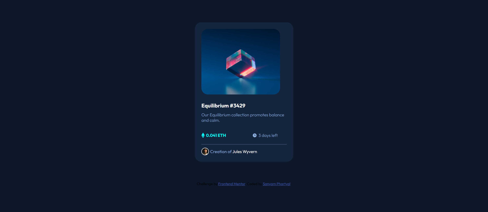
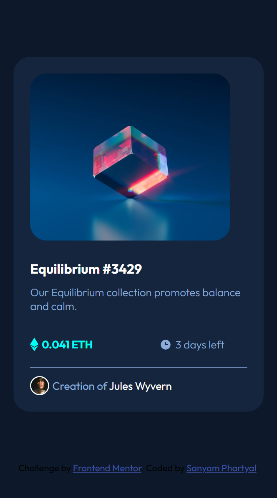

# Frontend Mentor - NFT preview card component solution

This is my solution to the [NFT preview card component challenge on Frontend Mentor](https://www.frontendmentor.io/challenges/nft-preview-card-component-SbdUL_w0U). This challenge helped me improve my skills in writing clean HTML and CSS, and applying responsive and interactive design principles.

## Table of contents

- [Overview](#overview)
  - [The challenge](#the-challenge)
  - [Screenshot](#screenshot)
  - [Links](#links)
- [My process](#my-process)
  - [Built with](#built-with)
  - [What I learned](#what-i-learned)
  - [Continued development](#continued-development)
- [Author](#author)

## Overview

### The challenge

Users should be able to:

- View the optimal layout depending on their device's screen size
- See hover states for interactive elements (image overlay and icon)

### Screenshot




### Links

- Solution URL: [GitHub Repo](https://github.com/Sanyam2511/nft-preview-page)
- Live Site URL: [Live Demo](https://sanyam2511.github.io/nft-preview-page/)

## My process

### Built with

- Semantic HTML5
- CSS custom properties
- Flexbox
- Mobile-first workflow

### What I learned

This project helped reinforce my understanding of:

- Structuring clean and semantic HTML
- Using Flexbox for vertical and horizontal alignment
- Implementing hover effects

Example of the hover effect I implemented:

```css
    .eth-container {
  display: flex;
  align-items: center; 
  color: hsl(178, 100%, 50%);
  font-family: 'outfit' , sans-serif;
  font-weight: bold;
  font-size: small;
  margin: 0px;
}

.eth-icon {
  width: 10px;  
  height: auto;
  margin: 0px 4px 0px 20px;
}

.eth-icon:hover{
    cursor: pointer;
    color: hsl(178, 100%, 50%);
}
```

## Author

- Website - [Sanyam Phartyal](https://sanyam2511.github.io/portfolio/)
- Frontend Mentor - [@Sanyam2511](https://www.frontendmentor.io/profile/Sanyam2511)
